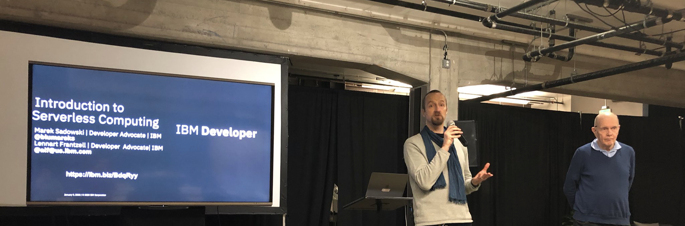

# ch6-app
This is an example iOS app with Serverless Backend explained in Serverless Swift by Apress.

- [step 01 - a basic app](01-basic-app/hacker-news)
- [step 02 - MBaaS](02-swift-actions)
- [step 03 - fully functional app](03-nlu-app/hacker-news)

Click on the links above to see the details and refer to the book.

We hope you will enjoy the book and our examples - check the meetups and webinars by Marek Sadowski and Lennart Frantzell

*Marek Sadowski (left) and Lennart Frantzell (right) presenting at the Serverless meetup hosted in Galvanize in San Francisco in January 2020.*
